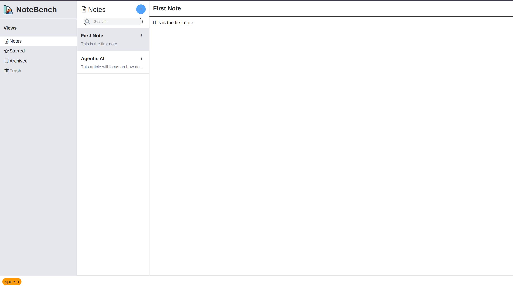

# NoteBench

A modern, responsive note-taking application built with React.js.

NoteBench is designed to provide a clean and focused environment for creating, organising, and managing notes. The application follows a structured three-panel layout that separates navigation, note management, and note editing.

---

## 📸 Preview

### Main Interface



---

## ✨ Features

### 📝 Note Management

- Create new notes using the `+` button.
- Automatically focus the note title when creating a new note.
- Edit note titles and content.
- Select notes from the note list.
- Prevent empty notes from being unnecessarily created.
- Display note title and content preview in the note list.

### ⭐ Starred Notes

- Mark notes as starred.
- View all starred notes in the Starred section.
- Starred notes remain available in their original Notes view.
- Unstar notes from the appropriate action menu.

### 📁 Archive

- Archive notes that are no longer needed in the main Notes view.
- View archived notes separately.
- Unarchive notes to restore them to the main Notes view.

### 🗑️ Trash

- Move notes to Trash instead of immediately deleting them.
- Restore notes from Trash.
- Permanently delete notes using the `Delete Forever` action.

### ⋮ Context Actions

Each note provides a three-dot action menu for note-specific operations.

Available actions depend on the current view:

#### Notes

- Star / Unstar
- Archive
- Move to Trash

#### Starred

- Archive
- Move to Trash

#### Archived

- Unarchive
- Move to Trash

#### Trash

- Restore
- Delete Forever

### 🔍 Search

A search interface is included in the note list area for finding notes.

### 🎯 Focused Editing Experience

When creating a new note, the title input automatically receives focus so the user can immediately start typing.

---

## 🖥️ Interface Structure

NoteBench uses a three-panel layout:

```text
┌────────────────┬────────────────┬─────────────────────────────┐
│                │                │                             │
│    Views       │   Active View  │         Note Area           │
│                │                │                             │
│  • Notes       │   Search       │         Note Title          │
│  • Starred     │                │         ──────────          │
│  • Archived    │   Note List    │                             │
│  • Trash       │                │         Note Content        │
│                │                │                             │
├────────────────┴────────────────┴─────────────────────────────┤
│                            Footer                              │
└────────────────────────────────────────────────────────────────┘