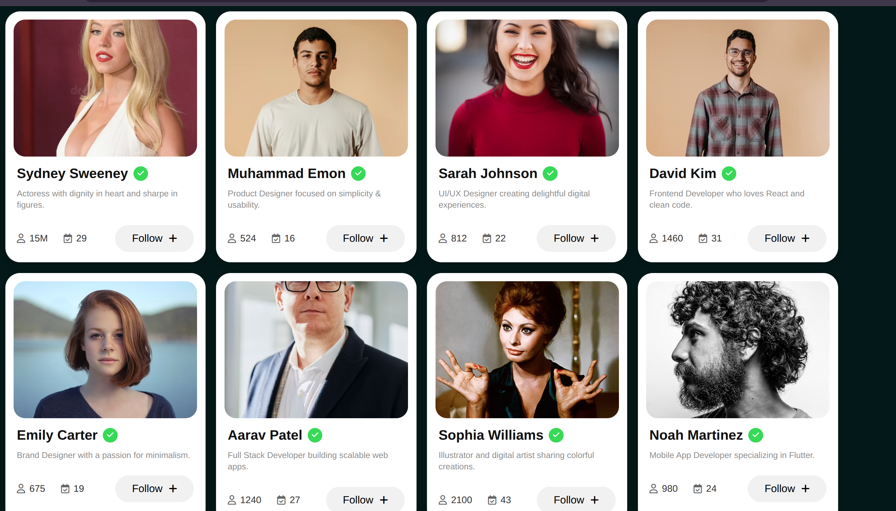

# React User Cards

A simple React project built to practice **Components** and **Props**. This project displays multiple user profile cards by passing user data as props from a parent component to a reusable `Card` component.

## 📌 What I Learned

- Creating reusable React components
- Passing data using props
- Rendering multiple components using `map()`
- Organizing data in an array of objects
- Basic component-based project structure

## 🚀 Features

- Displays multiple user profile cards
- Dynamic rendering using an array of user objects
- Reusable `Card` component
- Clean and responsive UI

## 🛠️ Tech Stack

- React
- JavaScript (ES6+)
- CSS

## 📂 Project Structure

```
src/
│── components/
│   ├── Card.jsx
│   └── Users.jsx
│
├── App.jsx
├── index.js
└── styles.css
```

## 📖 How It Works

1. User information is stored in an array of objects.
2. The `Users` component loops through the array using `map()`.
3. Each user object is passed as props to the reusable `Card` component.
4. The `Card` component displays the user's image, name, bio, follower count, and project count.

## 🎯 Purpose

This is a beginner-friendly mini project created while learning React fundamentals. The main focus was understanding how **components** and **props** work together to build reusable and maintainable UIs.

## 📸 Preview



## 📄 License

This project is created for learning purposes.