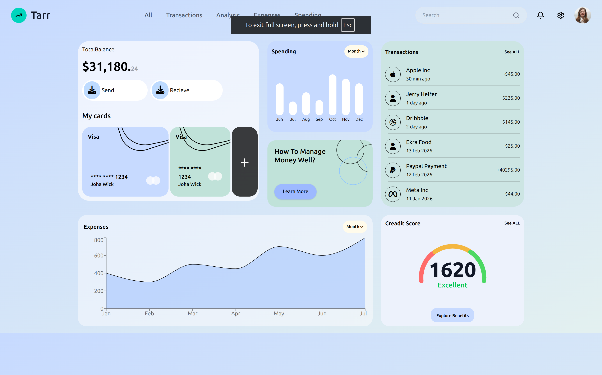

# React First Mini Project 02

A modern financial dashboard built using **React.js** and **Tailwind CSS**.

This project was created as a practical exercise to strengthen my understanding of **React Components, Component Composition, Props, Props Drilling, Reusable Components, and Responsive UI Development**.

---

## 📸 Screenshot



> Final dashboard UI built with React.js and Tailwind CSS.

---

## 🎯 Project Goal

The main goal of this project was not just to build a dashboard UI.

The goal was to understand how a large React interface can be broken down into smaller, reusable components and how data flows between those components.

### Concepts Practiced

- React Components
- Component Composition
- Reusable Components
- Props
- Props Destructuring
- Props Drilling
- Parent-to-Child Data Flow
- Nested Components
- Component Responsibility
- React Project Structure
- Tailwind CSS
- Responsive Layouts
- Basic SVG / Chart Integration

---

# 🧠 What I Learned

## 1. React Components

A large UI should not be written inside one giant component.

Instead, the UI can be divided into smaller components.

For example:

```text
Dashboard
│
├── BalanceCard
├── SpendingCard
├── TransactionsCard
├── ExpensesCard
└── CreditScoreCard
```

Each component has its own responsibility.

This makes the application:

- Easier to understand
- Easier to maintain
- Easier to modify
- Easier to reuse

---

## 2. Component Composition

React allows us to build large interfaces by combining smaller components.

For example:

```jsx
const Dashboard = () => {
  return (
    <div>
      <BalanceCard />
      <SpendingCard />
      <TransactionsCard />
      <ExpensesCard />
      <CreditScoreCard />
    </div>
  );
};
```

The `Dashboard` component does not need to know every implementation detail of each card.

Its responsibility is mainly to compose the UI.

This is called **Component Composition**.

---

## 3. Props

Props allow a parent component to send data to a child component.

Example:

```jsx
const Dashboard = () => {
  return (
    <BalanceCard
      balance="31,180.24"
      username="Jack Wilson"
    />
  );
};
```

The child component receives the props:

```jsx
const BalanceCard = ({ balance, username }) => {
  return (
    <div>
      <h1>{balance}</h1>
      <p>{username}</p>
    </div>
  );
};
```

The data flows like this:

```text
Dashboard
    │
    │ Props
    ▼
BalanceCard
```

This represents the basic React data flow:

```text
Parent
  ↓
Child
```

---

## 4. Props Drilling

Props drilling happens when data needs to be passed through multiple components to reach a deeply nested component.

Example:

```text
App
 │
 ▼
Dashboard
 │
 ▼
BalanceSection
 │
 ▼
BalanceCard
 │
 ▼
UserInfo
```

If `App` owns the data but `UserInfo` needs it, the data may need to be passed through every component.

```jsx
<App user={user} />
```

↓

```jsx
<Dashboard user={user} />
```

↓

```jsx
<BalanceSection user={user} />
```

↓

```jsx
<BalanceCard user={user} />
```

↓

```jsx
<UserInfo user={user} />
```

This is called **Props Drilling**.

The purpose of practicing this project is to understand how props move through the React component tree before learning solutions such as **Context API** or external state management.

---

## 5. Understanding Data Flow

React follows a one-way data flow.

The general pattern is:

```text
Parent Component
       │
       │ Props
       ▼
Child Component
       │
       │ Props
       ▼
Nested Child
```

Data normally flows:

```text
Top
 ↓
Down
```

This is also called **unidirectional data flow**.

Understanding this concept is extremely important for building larger React applications.

---

# 📁 Project Structure

```text
React-first-mini-project02/
│
├── src/
│   │
│   ├── Components/
│   │   │
│   │   ├── Dashboard.jsx
│   │   ├── BalanceCard.jsx
│   │   ├── SpendingCard.jsx
│   │   ├── TransactionsCard.jsx
│   │   ├── ExpensesCard.jsx
│   │   └── CreditScoreCard.jsx
│   │
│   ├── App.jsx
│   │
│   └── main.jsx
│
├── screenshots/
│   └── dashboard.png
│
├── public/
│
├── package.json
│
└── README.md
```

---

# 🧩 Component Responsibilities

## Dashboard.jsx

Responsible for:

- Overall page layout
- Combining dashboard components
- Managing the grid structure
- Organizing the page sections

Component hierarchy:

```text
Dashboard
│
├── BalanceCard
├── SpendingCard
├── TransactionsCard
├── ExpensesCard
└── CreditScoreCard
```

---

## BalanceCard.jsx

Responsible for displaying:

- Total balance
- Send button
- Receive button
- User cards
- Bank card information

---

## SpendingCard.jsx

Responsible for displaying:

- Spending overview
- Monthly spending
- Bar chart
- Month selector

---

## TransactionsCard.jsx

Responsible for displaying:

- Recent transactions
- Transaction users
- Transaction amounts
- Transaction dates

---

## ExpensesCard.jsx

Responsible for displaying:

- Expense analytics
- Expense graph
- Dates
- Amount estimation
- Graph indicators

---

## CreditScoreCard.jsx

Responsible for displaying:

- Credit score
- Credit rating
- Credit score visualization
- Benefits button

---

# 🎨 Styling

The project uses **Tailwind CSS** for styling.

Instead of writing traditional CSS classes, Tailwind utility classes are used directly inside JSX.

Example:

```jsx
<div className="rounded-3xl bg-white p-6">
  <h1 className="text-2xl font-semibold">
    Total Balance
  </h1>
</div>
```

This project helped me understand how Tailwind CSS can be used to build modern interfaces quickly.

---

# 📱 Responsive Design

The dashboard uses Tailwind's responsive utility classes.

Example:

```jsx
<div className="grid grid-cols-12 gap-6">
```

And:

```jsx
<div className="col-span-12 lg:col-span-5">
```

This allows the layout to adapt to different screen sizes.

The dashboard uses a responsive grid where cards can occupy different numbers of columns depending on the viewport.

---

# 🔄 Component Data Flow

The overall component structure can be visualized as:

```text
App
 │
 ▼
Dashboard
 │
 ├───────────────┐
 │               │
 ▼               ▼
BalanceCard    SpendingCard
 │
 │
 ▼
User Information
```

The complete dashboard is composed of multiple independent UI sections:

```text
Dashboard
│
├── BalanceCard
│
├── SpendingCard
│
├── TransactionsCard
│
├── ExpensesCard
│
└── CreditScoreCard
```

As the application becomes more dynamic, data can be passed from parent components to these child components using props.

---


## 🛠️ Technologies Used

- React.js
- JavaScript
- Tailwind CSS
- HTML
- CSS
- SVG

---

## 📌 Project Status

**Completed ✅**

This project was created as part of my journey to master React fundamentals and understand how real-world React applications are structured using reusable components and data flow.
